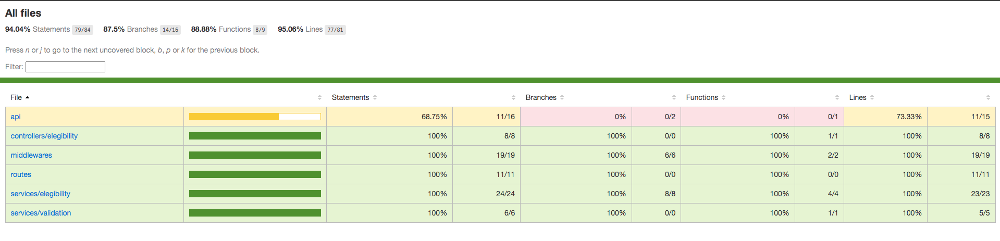

# API de checagem de elegibilidade de clientes

## Índice

- [Descrição](#descrição)
- [CI Actions](#ci-actions)
- [Como Usar Online](#como-usar-online)
- [Como Usar Via Docker](#como-usar-via-docker)
- [Pré-requisitos](#pré-requisitos-para-rodar-a-aplicação)
- [Como Usar Localmente](#como-usar-no-ambiente-local)
- [Desenvolvimento](#desenvolvimento)
- [Arquitetura](#arquitetura)
- [Outros Scripts da Aplicação](#outros-scripts-configurados-na-aplicação)
- [Cobertura de Testes](#cobertura-de-testes)
- [Pontos de Melhoria](#pontos-de-melhoria)
- [Contato](#contato)

## Descrição

Repositório com o código de uma **API Rest**, em Node.js com Express.

Esta API foi desenvolvida para o desafio técnico do processo seletivo impulsionado da Lemon com a Trybe. 
Nela tem apenas uma rota `POST/elegibility` que recebe informações da conta de luz do cliente no corpo da requisição e retorna um Objeto informando se o cliente é elegível ou não para os serviços da Lemon.

Antes de retornar a informação da elegibilidade, a API faz a validação dos dados envidos, se algum dos dados não estiver presente ou mal formatado a API retorna com status 400 e uma mensagem de erro no corpo da resposta. 

Caso os dados estejam todos presentes e válidos, a API retorna com status 200 e com um objeto no corpo da resposta. Este objeto, em caso positivo de elegibilidade, informa também a economia de CO2 que o cliente fará aderindo ao serviço; já em caso negativo de elegibilidade, informa o ou os motivos da negativa.

Para ver detalhadamente os parâmetros esperados, as possíveis respostas e sua formatação, acesse o Swagger (informações abaixo).

## CI Actions

Foi implementado `Continuous Integration` nessa aplicação. Na abertura e atualizações de PR's serão executadas duas `actions`: 

- A primeira rodará o ESLint para fazer a análise estática do código.
- A segunda rodará os testes unitários e de integração para analisar a integridade do código.

O arquivo com as `actions` pode ser encontrado [aqui](https://github.com/rslfilho/desafio-lemon/tree/main/.github/workflows).

Fique à vontade para fazer contribuições que achar pertinente nesta aplicação, abrindo um PR. Todas são bem-vindas.

## Como usar online

Apliquei `Continuous Deployment` nessa aplicação usando Docker para construir a aplicação no Heroku.

A `CD` está integrada ao Github, gerando uma nova build sempre que há atualizações na branch `main` deste repositório. 

Para acessar a página Swagger da aplicação rodando e/ou testar a aplicação, ver detalhadamente os parâmetros esperados, as possíveis respostas e sua formatação, basta clicar [aqui](https://desafio-lemon.herokuapp.com/swagger/).

Para fazer requisições à aplicação rodando, faça uma requisição `POST` com o parâmetro esperado para `https://desafio-lemon.herokuapp.com/elegibility`, exemplo:

```bash
curl -X 'POST' \
  'https://desafio-lemon.herokuapp.com/elegibility' \
  -H 'accept: application/json' \
  -H 'Content-Type: application/json' \
  -d '{
  "numeroDoDocumento": "14041737706",
  "tipoDeConexao": "bifasico",
  "classeDeConsumo": "comercial",
  "modalidadeTarifaria": "branca",
  "historicoDeConsumo": [
    3878,
    9760,
    5976,
    2797,
    2481,
    5731,
    7538,
    4392,
    7859,
    4160,
    6941,
    4597
  ]
}'
```

## Como usar via Docker

Se você tem o motor do Docker na sua máquina, pode rodar facilmente a aplicação executando a imagem diretamente do Docker Hub.

1 - Execute o comando:

```bash
docker container run -d --name rslfilho-desafio-lemon -p 3000:3000 rslfilho/desafio-lemon:v1
```

2 - A aplicação estárá rodando e acessível em `http://localhost:3000/`.

3 - Para conseguir uma previsão, faça uma requisição `POST` na rota `http://localhost:3000/elegibility` passando os parâmetros esperados, exemplo:

```bash
curl -X 'POST' \
  'http://localhost:3000/elegibility' \
  -H 'accept: application/json' \
  -H 'Content-Type: application/json' \
  -d '{
  "numeroDoDocumento": "14041737706",
  "tipoDeConexao": "bifasico",
  "classeDeConsumo": "comercial",
  "modalidadeTarifaria": "branca",
  "historicoDeConsumo": [
    3878,
    9760,
    5976,
    2797,
    2481,
    5731,
    7538,
    4392,
    7859,
    4160,
    6941,
    4597
  ]
}'
```

4 - Para acessar a descrição da API e/ou testar seu funcionamento, ver detalhadamente os parâmetros esperados, as possíveis respostas e sua formatação, basta acessar `http://localhost:3000/swagger/`.

## Pré-requisitos para rodar a aplicação

- Node.js
- NPM

## Como usar no ambiente local

1 - Para clonar o repositório, vá até o diretório onde deseja clonar, execute o `git clone` e depois entre no diretório criado:

```bash
git clone git@github.com:rslfilho/desafio-lemon.git
cd desafio-lemon
```

2- Já dentro do diretório, instale as depedências (pode usar `npm` ou `yarn`):

```bash
yarn install
```
ou
```bash
npm install
```

3 - Depois de instaladas as depedências, inicie a aplicação:

```bash
yarn start
```
ou
```bash
npm start
```

4 - A aplicação estárá rodando e acessível em `http://localhost:3000/`. A porta pode modificar se tiver uma variável `PORT` no ambiente que estiver executando;

5 - Para conseguir uma previsão, faça uma requisição `POST` na rota `http://localhost:3000/elegibility` passando os parâmetros esperados, exemplo:

```bash
curl -X 'POST' \
  'http://localhost:3000/elegibility' \
  -H 'accept: application/json' \
  -H 'Content-Type: application/json' \
  -d '{
  "numeroDoDocumento": "14041737706",
  "tipoDeConexao": "bifasico",
  "classeDeConsumo": "comercial",
  "modalidadeTarifaria": "branca",
  "historicoDeConsumo": [
    3878,
    9760,
    5976,
    2797,
    2481,
    5731,
    7538,
    4392,
    7859,
    4160,
    6941,
    4597
  ]
}'
```

6 - Para acessar a descrição da API e/ou testar seu funcionamento, ver detalhadamente os parâmetros esperados, as possíveis respostas e sua formatação, basta acessar `http://localhost:3000/swagger/`.

## Desenvolvimento

O desafio solicitava a criação de um programa que recebesse as informações da conta de luz de um possível cliente e retornasse a elegibilidade ou não deste cliente para os serviços da Lemon.

Resolvi criar uma API REST para receber essas solicitações, verificar os dados e retornar a resposta esperada em cada caso. Dessa forma qualquer pessoa usuária, ou outra aplicação, pode se comunicar com esta e, enviando as informações necessárias, recebe a resposta sobre a elegibilidade ou não do possível cliente.

A API foi desenvolvida em Node.js com Express e utilizando TDD (Test Driven Development). Para cada parte de cada funcionalidade eu desenvolvi primeiro os testes unitários referentes a essa parte e depois implementei o código relacionado.

Além disso, as dependências da aplicação são:

- `cors@^2.8.5` para liberação de acesso
- `joi@^17.6.0` para validação de `schemas` e dados
- `swagger-ui-express@^4.3.0` para criação da página visual de descrição e teste da API
- `yamljs@^0.3.0` para leitura do arquivo `yaml` de configuração do Swagger

No ambiente de desenvolvimento ainda são usadas as dependências:

- `mocha@^9.2.2`, `chai@^4.3.6`, `chai-http@^4.3.0`, e `sinon@^13.0.1` para os testes;
- `nyc@^15.1.0` para gerar os relatórios de cobertura de testes
- `nodemon@^2.0.15` para iniciar a aplicação com reinício automático
- `eslint@^8.8.0`, `eslint-config-trybe-backend@^1.0.4`, `eslint-plugin-import@^2.25.4`, `eslint-plugin-mocha@^10.0.3` e `eslint-plugin-sonarjs@ˆ0.11.0` para configuração do ESLint

## Arquitetura

Usei uma arquitetura baseada em MSC (Model, Service, Controller), mas sem a camada de Model, já que não temos conexão nenhuma com API externa, banco de dados ou qualquer outra fonte de dados externa.

No mais, o Service para tratar os dados e executar a lógica da aplicação e Controller para receber e tratar os dados da requisição e, depois de acessar o Service, retornar a resposta ao usuário.

A API está contida na pasta `/src` dentro da raiz do repositório, nela temos:

- `/api` arquivos de configuração e início da aplicação
- `/controllers` arquivos de Controllers da aplicação
- `/helpers` funções ou dados auxiliares
- `/middlewares` arquivos de middlewares como o de Erro, Validação e o de configuração do Swagger
- `/routes` configuração de roteadores do Express
- `/services` arquivos de Serviços da aplicação
- `/tests` arquivos de testes, unitários e de integração

## Outros Scripts configurados na aplicação

* `yarn dev` ou `npm run dev` para rodar a aplicação com Nodemon e reinício automático na atualização de qualquer arquivo;
* `yarn test` ou `npm run test` para rodar todos os testes;
* `yarn test:coverage` ou `npm run test:coverage` para rodar todos os testes e gerar o relatório de cobertura em html, acessível na pasta `/coverage/lcov-report/`;
* `yarn test:unit` ou `npm run test:unit` para rodar apenas os testes unitários;
* `yarn test:unit:coverage` ou `npm run test:unit:coverage` para rodar apenas os testes unitários e gerar o relatório de cobertura na tela do terminal;
* `yarn test:integration` ou `npm run test:integration` para rodar apenas os testes de integração;
* `yarn test:integration:coverage` ou `npm run test:integration:coverage` para rodar apenas os testes de integração e gerar o relatório de cobertura na tela do terminal;
* `yarn lint` ou `npm run lint` para rodar o ESLint;

## Cobertura de testes

Desenvolvi 65 asserções entre testes unitários e de integração para cobertura de testes da aplicação.



A cobertura de testes atingiu mais de 95%.

## Pontos de melhoria

- Criar uma página simples de Front-end para o usuário poder preencher os dados num formulário e enviar a requisição.

## Contato

Desenvolvido por Roberval Filho

Email: rslfilho@gmail.com

Github: https://github.com/rslfilho

LinkedIn: https://www.linkedin.com/in/rslfilho/
